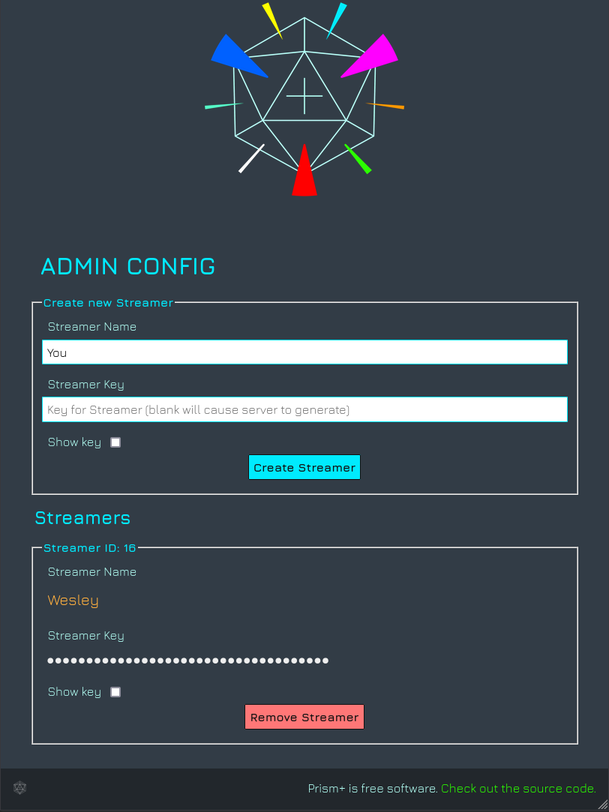
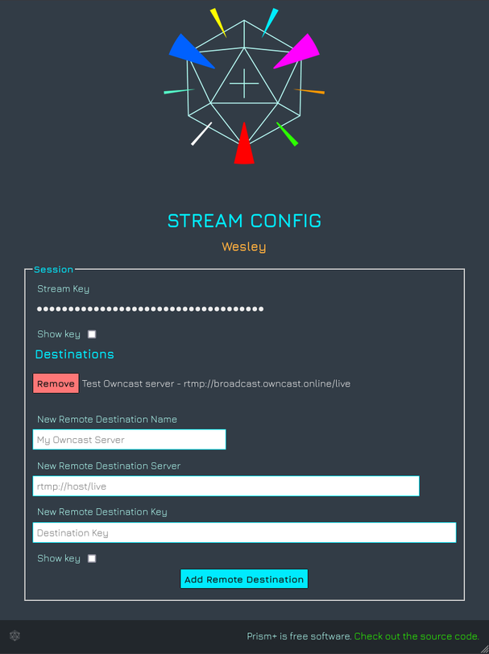

# prism+


**Use at your own risk!  It has worked for us.. but very much alpha quality!**

Based on [prism by muesli](https://github.com/muesli/prism).

Prism+ lets you multicast your rtmp stream to multiple destinations.  You point your OBS at prism+ and then add your destinations to prism+.  It will relay your stream to the destinations. Allowing you to stream to multiple platforms at the same time.

Prism+ main Features:
* Admin web interface to login and manage streamers and sessions
* Ability to add streamers with their streamkeys
* Ability for streamers to login and add/remove destinations

#### Verified working Destinations
* Owncast
* Twitch
* Youtube - only seems to work with variable bitrate setting in OBS.  Your results may vary

## Starting prism+

1. Clone the repo locally and enter the folder

2. Build frontend.  The frontend is written in svelte

```
cd web
npm install
npm run build
```

3. Build backend.  The backend is written in golang.

```
go get
go build
```

4. Run

```
./prismplus
```

On startup it will automatically generate an adminKey.  If you want to define your own adminKey so that it will be the same every startup you can start up with:

```
./prismplus --adminKey=your-super-secure-key
```

Prism+ will now be listening on:
* Web interface and API - http://localhost:5383
* RTMP - localhost:1935

## Using Prism+

To add your first streamer goto: http://localhost:5383/admin

Enter the adminKey you provided or that was auto generated.



Once the streamer is created they can login to: http://localhost:5383 with their streamKey

From here they can add their destinations



Now the streamer just needs to point OBS (or their software of choice) to rtmp://localhost:1935/live with the streamKey.
